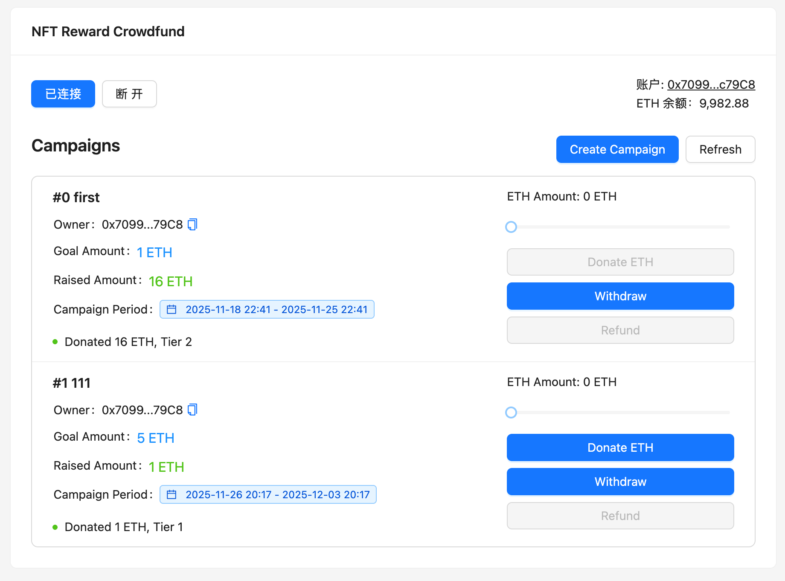

# frontend (Vue3 + Vite + TypeScript)

This frontend is a minimal scaffold for interacting with the `Crowdfund` contract.

主要技术栈：Vue 3 + Vite + TypeScript、Ant Design Vue、ethers.js (v6)



## 快速开始（macOS, zsh）

1. 启动本地链（Anvil）并在部署合约后将输出合约地址，把它填到 [`frontend/src/constants/contracts.ts`](src/constants/contracts.ts) 的 `CROWDFUND_ADDRESS`。

2. 在 frontend 目录安装依赖并运行

```bash
cd frontend
npm install
npm run dev
```

3. 调试
- 打开浏览器访问 http://localhost:3000
- 点击“连接钱包”使用 MetaMask 把 Anvil 的私钥导入钱包
- 连接钱包后即可创建众筹项目和参与众筹
